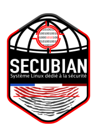

# Bienvenue sur l'espace documentaire de SecuBian




SecuBian est une distribution GNU/Linux.
Basée sur **Kali/Debian**, elle a pour vocation de fournir un système d'exploitation sécurisé, documenté et pré-configuré pour des utilisations liées à la sécurité informatique.

SecuBian se veut ainsi un outil permettant de faciliter les audits de cyber-sécurité, les tests d'intrusions mais aussi les analyses inforensiques permettant de restaurer et comprendre l'origine de défaillance système faisant suite à des pannes matérielles, à des infections virales ou à des attaques par des individus mal intentionnés.

Secuip, Kidrek


## Installer des pré-requis

```
# apt install -y apache2 libapache2-mod-php php-xml
```

## Configuration du service apache2

```
# a2enmod rewrite

# echo "<VirtualHost 127.0.0.1:80>
	ServerAdmin webmaster@localhost
	DocumentRoot /var/www/secubian-wiki
        <Directory /var/www/secubian-wiki>
        	Options FollowSymLinks
        	AllowOverride All
        </Directory>
</VirtualHost>" > /etc/apache2/sites-available/000-secubian-wiki.conf

# a2dissite 000-default
# a2ensite 000-secubian-wiki
```

## Déploiement du wiki

```
# git clone https://github.com/kidrek/secubian-wiki.git /var/www/
# chown -R www-data:www-data /var/www/secubian-wiki
```
