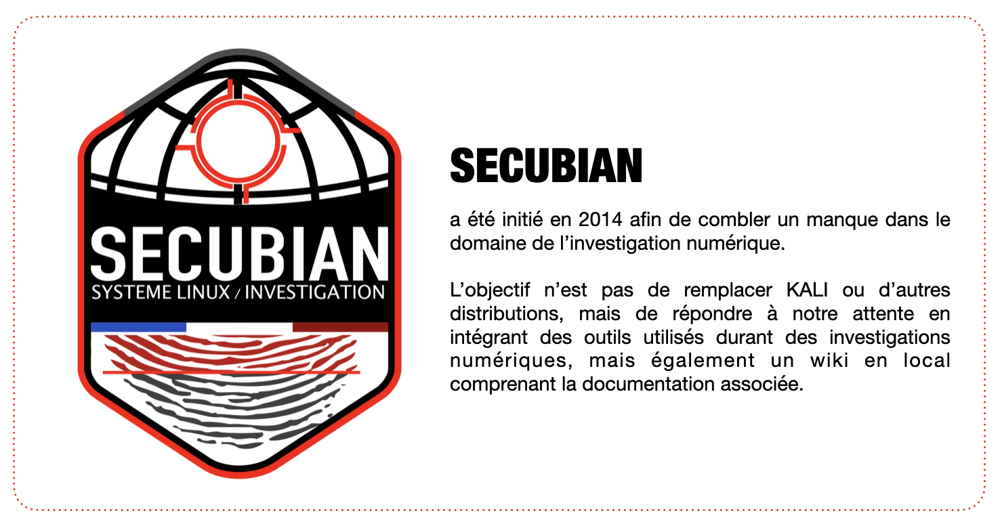

.. Wiki documentation master file, created by
   sphinx-quickstart on Mon Jan  4 10:12:06 2021.
   You can adapt this file completely to your liking, but it should at least
   contain the root `toctree` directive.

\

Documentation  
===============

Voici un receuil de la documentation relative aux outils intégrés au sein de la distribution Secubian. 
De plus, vous trouverez de la documentation générale liée aux domaines de la cybersécurité.

L'ensemble des outils sont recensés :   `ici <./outils/liste_outils.html>`_  

Créateurs   
===============

- Winston DELBEY
- Cédric MAURUGEON

.. toctree::
   :hidden:
   :maxdepth: 2
   :caption: // Méthodologies & Playbooks

   playbooks/introduction.md

.. toctree::
   :hidden:
   :maxdepth: 2
   :caption: // Investigation Numérique

   documentations/vmware.md

.. toctree::
   :hidden:
   :maxdepth: 2
   :caption: // Outils

   outils/liste_outils.md
   outils/dfir_iris_web.md
   outils/firefox.md
   outils/log2timeline_plaso.md
   outils/timesketch.md

