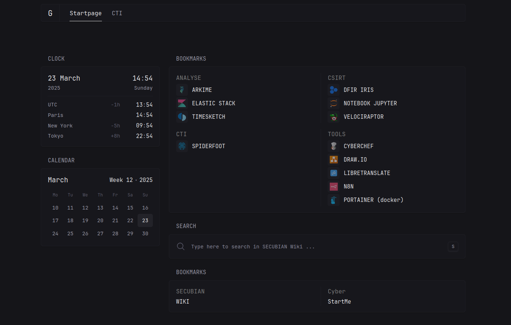

"SECUBIAN is a French Linux distribution focused on Incident Response."

SECUBIAN est un projet de distribution Linux permettant de mettre à disposition des équipes de réponse à incident la majorité des outils nécessaires à la collecte, le traitement et l'analyse de données.

.. image:: img/desktop.png
  :width: 700
  :alt: logo
  :align: center 

\

Les outils
===============

La page d'accueil par défaut de Firefox, accessible via l'URL : `http://127.0.0.1:8080 <http://127.0.0.1:8080>`_, permet de découvrir l'écosystème SECUBIAN via son wiki et les différentes solutions qui y sont présentes.

\

Les informations d'authentification nécessaires à l'usage de ces outils sont enregistrées dans la base de données keepass : ``$HOME/Documents/secubian.kdbx`` dont le mot de passe, par défaut, est ``secubian``. L'outil ``KeePassXC`` présent dans les raccourcis du dock permet d'y accéder.

Voici une liste non exhaustive des outils présents : 

- Collecte : ``dd``, ``dc3dd``, ``tcpdump``
- Traitement : ``log2timeline``, ``volatility2``, ``volatility3``
- Analyse : ``Zircolite``, ``Timesketch`` (présent uniquement sur architecture amd64 pour le moment), ``OpenSearch``, ``Capa``, ``wireshark``, règles ``SIGMA`` & ``YARA``, ``MVT - Mobile Verification Toolkit``
- Suivi d'incident : ``DFIR IRIS Web``
- Autres : l'orchestrateur ``N8N``, le traducteur déconnecté ``LibreTranslate``, etc.. 

PS: D'autres outils dédiés aux domaines du Pentest et de l'OSINT sont également disponibles.

Vous trouverez tous les autres recensés :   `ici <./outils/liste_outils.html>`_  

La documentation
================

Le projet intègre 2 sous-projets dérivés nommés, `secubian-wiki <https://github.com/kidrek/secubian-wiki>`_ et  `secubian-JupyterNotebook <https://github.com/kidrek/secubian-JupyterNotebook>`_. Ces derniers sont téléchargés en local dans le répertoire ``$HOME/Documents/Documentation`` et ``$HOME/Documents/Playbooks``, respectivement, de votre profil utilisateur. Ils permettent d'apporter de la documentation et de la méthodologie disponibles même OFFLINE.

Investigation numérique
================

Un répertoire ``Cases`` est également présent dans le répertoire ``$HOME/Documents/`` de votre profil utilisateur, pour faciliter la gestion des preuves. \
Celles-ci pourront y être déposées pour analyse. 

Créateurs   
===============

- Winston DELBEY
- Cédric MAURUGEON

.. toctree::
   :hidden:
   :maxdepth: 2
   :caption: // Méthodologies

   methodologies/00_introduction.md
   methodologies/02_hdd_analyse.md
   methodologies/vmware.md

.. toctree::
   :hidden:
   :maxdepth: 2
   :caption: // Playbooks

   playbooks/introduction.md

.. toctree::
   :hidden:
   :maxdepth: 2
   :caption: // Outils

   outils/liste_outils.md
   outils/dfir_iris_web.md
   outils/firefox.md
   outils/log2timeline_plaso.md
   outils/timesketch.md
   outils/velociraptor.md

.. toctree::
   :hidden:
   :maxdepth: 2
   :caption: // Artefacts

   artefacts/00_windows.md
   artefacts/00_linux.md
