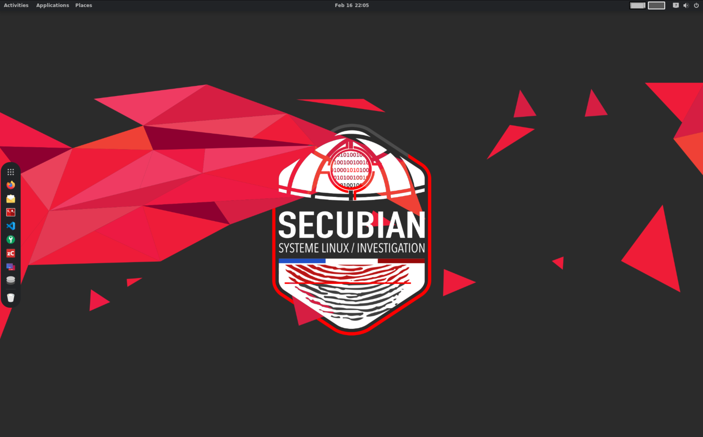

.. Wiki documentation master file, created by
   sphinx-quickstart on Mon Jan  4 10:12:06 2021.
   You can adapt this file completely to your liking, but it should at least
   contain the root `toctree` directive.

Documentation
===============

"SECUBIAN is a French Linux distribution focused on Incident Response."

SECUBIAN est un projet de distribution Linux permettant de mettre à disposition des équipes de réponse à incident la majorité des outils nécessaires à la collecte, le traitement et l'analyse des données nécessaires pour mener une investigation numérique.

\

Pour faciliter toutes ces phases, la distribution Linux intègre 2 projets complémentaires nommés, `secubian-wiki <https://github.com/kidrek/secubian-wiki>`_ et `secubian-JupyterNotebook <https://github.com/kidrek/secubian-JupyterNotebook>`_. Ces 2 projets, présents dans le répertoire ``$HOME/Documents`` de votre profil utilisateur, permettent d'apporter des outils, de la documentation et de la méthodologie disponibles même OFFLINE.

Un répertoire ``$HOME/Documents/Cases`` est également présent pour accueillir l'ensemble des collectes pour les analyser. Chacun des documents json, et csv (à terme), présents dans ce dossier, et provenant de vos analyses seront indexés dans l'instance ``OpenSearch`` (via ``filebeat`` et ``logstash``, si l'ensemble de ces services sont fonctionnels) pour faciliter l'investigation.

PS: D'autres outils dédiés aux domaines du Pentest et de l'OSINT sont également disponibles.

Voici une liste non exhaustive des outils présents : 

- Collecte : ``dd``, ``dc3dd``, ``tcpdump``
- Traitement : ``log2timeline``, ``volatility2``, ``volatility3``
- Analyse : ``Zircolite``, ``Timesketch`` (présent uniquement sur architecture amd64 pour le moment), ``OpenSearch``, ``Capa``, ``wireshark``, règles ``SIGMA`` & ``YARA``, ``MVT - Mobile Verification Toolkit``
- Suivi d'incident : ``DFIR IRIS Web``

Vous trouverez tous les autres recensés :   `ici <./outils/liste_outils.html>`_  

Créateurs   
===============

- Winston DELBEY
- Cédric MAURUGEON

.. toctree::
   :hidden:
   :maxdepth: 2
   :caption: // Méthodologies

   methodologies/00_introduction.md
   methodologies/02_hdd_analyse.md
   methodologies/vmware.md

.. toctree::
   :hidden:
   :maxdepth: 2
   :caption: // Playbooks

   playbooks/introduction.md

.. toctree::
   :hidden:
   :maxdepth: 2
   :caption: // Outils

   outils/liste_outils.md
   outils/dfir_iris_web.md
   outils/firefox.md
   outils/log2timeline_plaso.md
   outils/timesketch.md
   outils/velociraptor.md

.. toctree::
   :hidden:
   :maxdepth: 2
   :caption: // Artefacts

   artefacts/00_windows.md
   artefacts/00_linux.md
