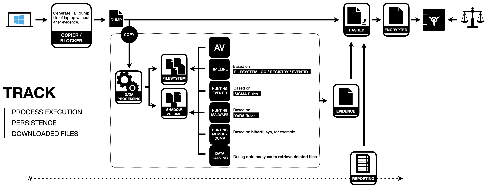
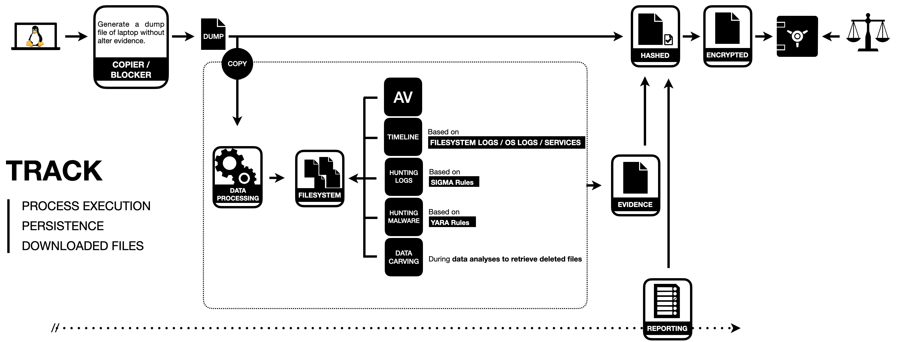

# Analyser un disque dur

Il n'est pas rare de devoir analyser un disque dur lors d'une investigation numérique.
Même si sur le papier cela parait simple, il y a néanmoins quelques bonnes pratiques à suivre à la lettre.
Ces dernières sont reprises dans la norme **ISO 27037** qui consiste à recenser l'ensemble des actions à réaliser pour :
- Identifier ;
- Collecter ;
- Aquérir ;
- Préserver l'ensemble des preuves numériques.

Voici deux schémas synthétisant **grandement** les actions à réaliser, sur le disque dur prélevé, en fonction du système d'exploitation présent. Etant donné qu'il s'agit des disques dur, nous considérons donc que la machine a été au préalable éteinte volontairement ou non.

