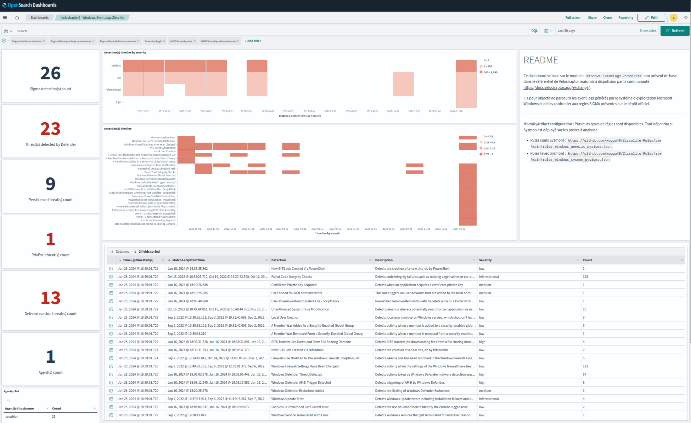
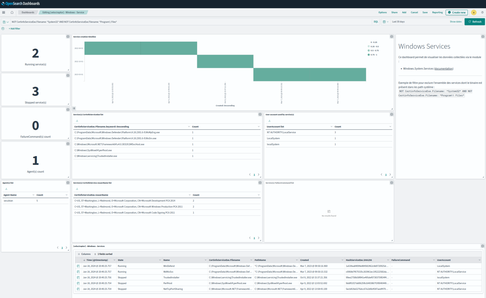
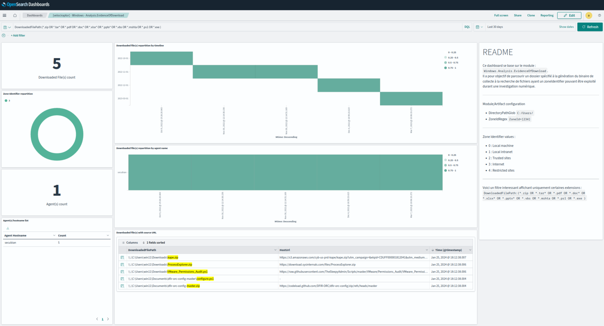
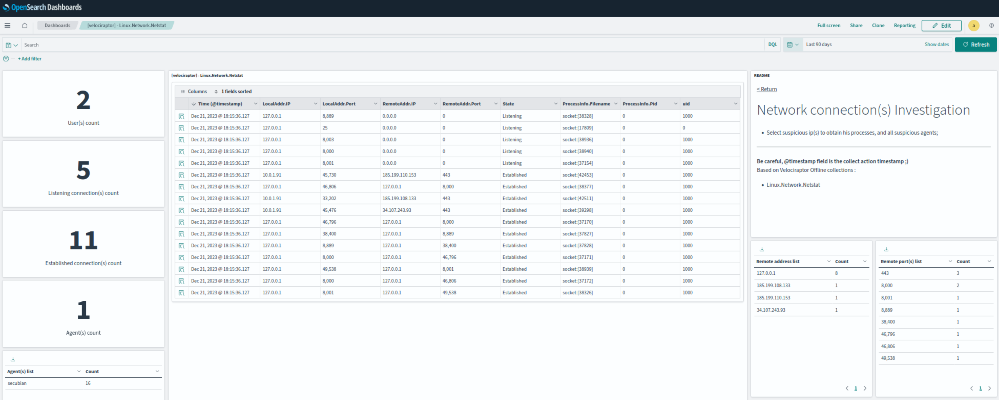

# Velociraptor


**Velociraptor** est outil open-source permettant de réaliser une collecte et une analyse d'artefact à grande ampleur.
Il propose deux modes de fonctionnement : 

- un mode connecté, via l'installation d'un agent. Ce mode permet ainsi via le langage de requête ```VQL``` d'effectuer des recherches de menaces, comme le permet **OSQuery**; 
- un mode non-connecté, via l'exécution d'un binaire à chaque collecte ;


Voici quelques liens utils : 

- la documentation : [https://docs.velociraptor.app](https://docs.velociraptor.app)
- les modules de base : [https://docs.velociraptor.app/artifact_references/](https://docs.velociraptor.app/artifact_references/)
- les modules partagés par la communauté : [https://docs.velociraptor.app/exchange/](https://docs.velociraptor.app/exchange/)


Personnellement, j'ai choisi ce second mode afin de limiter le nombre d'agent déployé sur les endpoints d'un SI.
De plus, l'agent velociraptor a souvent été utilisé comme implant par certains groupe d'attaquant :).
Une fois les modules sélectionnés, ces derniers sont intégrés dans un binaire qui sera destiné à être exécuté sur un ou plusieurs endpoints (via GPO par exemple), pour réaliser la collecte.
Une fois les données extraites (au format json) du système d'exploitation, ces dernières seront archivées, ou chiffrées selon votre choix puis stockées sur disque ou envoyées sur un serveur distant via des protocoles sécurisés.

Comme indiqué, le format privilégié est le json. Il est donc très facile d'indexer les données dans une solution telle que OpenSearch ou Splunk afin de les analyser. 

Un agent filebeat est d'ailleurs présent sur la distribution, et indexe automatiquement tous les JSON découverts dans le dossier ```/home/secubian/Documents/Cases```.

Voici quelques exemples de dashboard intégrés à OpenSearch présents sur la distribution.

- Analyse des Microsoft Windows Event par l'outil Zircolite ;



- Analyse des services Microsoft Windows ;



- Analyse des documents téléchargés via l'Alternate DataStream ZoneIdentifier ;



- Analyse des connexions réseaux présentes sur un système d'exploitation Linux ;
 


## Références : 
- https://medium.com/@artrebultan/velociraptor-incident-response-and-monitoring-setup-and-configuration-e5d62aed5477